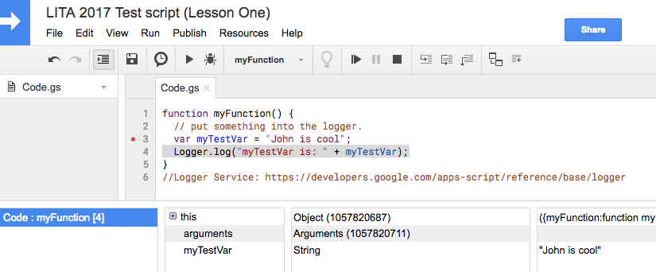

# Lesson 1 - Getting Oriented

In this lesson we'll talk about what Google Apps Script (GAS) is, create our first script, and examine the development environment.

#### Google Apps Script:

Allows you to create add-ons for Google Sheets, Docs, Slides, or Forms, automate your workflow, integrate with external APIs, and more. It is JavaScript "like" and doesn’t need to be compiled. Because it's built into Google, you don't have to worry about hosting, backups, security, patching your server/application, or uploading files to a server.

What can you do? Add a menu to a sheet, build a stand-alone application, or create a container bound application in a Google Sheet or Docs. You can also run a GAS application as a web service - independ from interfaces - that can be called from elsewhere on the web.

What can't you do? Google Apps scripts enforce quotas on the number of calls you can make. Keep this in mind when developing your script. See Quotas for Google Services at https://developers.google.com/apps-script/guides/services/quotas

## Lesson Steps

1. Open Google Drive: https://drive.google.com
2. Create a new GAS file by clicking the New button -> More -> Google Apps Script. If you don't see GAS, click on the Connect more apps link and search for Google. You should see Google Apps Script. Click the Connect button.
3. Note the Google Doc like environment
4. Name our file: "LITA 2017 Test script (Lesson 1)"
5. Examine the File menu:<br/>
"See Version History" is where you can see all the coding changes after a save.<br/>
"Manage Versions..." allows you to create versions of your code for deployment.<br/>
"Project Properties" contains detailed Google information about your project. Good to know it's there.<br/>
6. Examine the Edit menu:<br/>
Triggers allow you to have the script run at a certain time or run based on an action - like when a Google Form is submitted.<br/>
7. Examine the Publish menu - we'll talk about this in a future lesson but just know that this is how you would deploy a web app.
8. Examine the Resources menu - mostly beyond scope of this session<br/>
"Advanced Google Services" where you can, and have to turn on, other Google services to interface with them.<br/>
9. Let's add the following code which will declare a variable and put something into the Logger (delete what's there):
```javascript
function myFunction() {
  // put something into the logger.
  var myTestVar = "John is cool";
  Logger.log("myTestVar is: " + myTestVar);
}
```
10. Change myTestVar to have your name (we want you to be cool). Save the project with the disk icon or File -> Save. *[Remember you may have to authorize your script](../authorize.md)*
11. Examine the Run menu - You can run just a single function which can help for testing, or debug a single function.<br/>
12. Run the function: myFunction(), via the Run menu.
13. Examine the View menu:<br/>
"Execution Transcript" shows you all the events and things that happened during the execution.<br/>
"Logs" is where you can see what was output with the Logger. This is a helpful way to debug or troubleshoot problems.<br/>
14. Look at the log now. Are you cool?
15. Place a stop point (red dot) and using the Run menu, Debug the function: myFunction()<br /><br />

16. Take note of all the available information when you Debug. Logger and Debug can be helpful for figuring out problems with your code. Not that there are problems with your code. Just saying...

## Final Google Apps Script File

https://script.google.com/d/14b5L5NFBe5GyGSmZgW45zupXHSBfV9k-Y5O2ePi5fCqRb4L-EJf0wppS/edit?usp=sharing
*Don't try to run this script, you'll get an [error](../autherror.png). Copy the code and run it in your own Google Drive.*

## Resource list

Main GAS documentation: https://developers.google.com/apps-script/

Logger Service: https://developers.google.com/apps-script/reference/base/logger

Information about Troubleshooting/Debugger: https://developers.google.com/apps-script/guides/support/troubleshooting

GAS authorization: https://developers.google.com/apps-script/guides/services/authorization

Quotas for Google Services: https://developers.google.com/apps-script/guides/services/quotas

[Next Lesson](Lesson_2)
