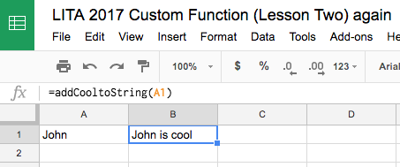

# Lesson Two - Create your own function

In this lesson we'll create our own function in a Google Sheet.

## Lesson Steps

1. Open Google Drive: https://drive.google.com
2. Create a new Google Sheet and name our file: "LITA 2017 Custom Function (Lesson Two)"
3. Click on Tools menu and choose Script Editor - This opens a script file that is associated with the sheet we just created. This is what’s called a bound script. 
>“A script is bound to a Google Sheets, Docs, or Forms file if it was created from that document rather than as a standalone script. The file a bound script is attached to is referred to as a "container". Bound scripts generally behave like standalone scripts except that they do not appear in Google Drive, they cannot be detached from the file they are bound to, and they gain a few special privileges over the parent file.”
4. Copy in this code overwriting everything that is there:
```javascript
function addCooltoString(input) {
   return input + " is cool";
}

function addTwoMoretoNumber(input) {
   return input + input + 2;
}
```
5. Save and name your bound script. This code has created a basic function that takes in some input and then returns that input with the string " is cool" appended to it. 
6. Let’s take a look at what it does in our sheet. Leave the script file open and go back to your GSheet tab. Enter in your first name into the A1 cell. Then in the B1 cell enter:
```=addCooltoString(A1)```
7. Tab off the cell. This will take your name and add “ is cool” to it.<br /><br />



5. Examine the File menu:<br/>
"See Version History" is where you can see all the coding changes after a save.<br/>
"Manage Versions..." allows you to create versions of your code for deployment.<br/>
"Project Properties" contains detailed Google information about your project. Good to know it's there.<br/>
6. Examine the Edit menu:<br/>
Triggers allow you to have the script run at a certain time or run based on an action - like when a Google Form is submitted.<br/>
7. Examine the Publish menu - we'll talk about this in a future lesson but just know that this is how you would deploy a web app.
8. Examine the Resources menu - mostly beyond scope of this session<br/>
"Advanced Google Services" where you can, and have to turn on, other Google services to interface with them.<br/>
9. Let's add the following code which will declare a variable and put something into the Logger (delete what's there):
```javascript
function myFunction() {
  // put something into the logger.
  var myTestVar = "John is cool";
  Logger.log("myTestVar is: " + myTestVar);
}
```
10. Save the project with the disk icon or File -> Save
11. Examine the Run menu - You can run just a single function which can help for testing, or debug a single function.<br/>
12. Run the function: myFunction()
13. Examine the View menu:<br/>
"Execution Transcript" shows you all the events and things that happened during the execution.<br/>
"Logs" is where you can see what was output with the Logger. This is a helpful way to debug or troubleshoot problems.<br/>
14. Place a stop point (red dot) and Debug the function: myFunction()


## Lesson Final Sheet

https://docs.google.com/spreadsheets/d/1wb8yw8zWIOyGSxPgmZvbjonZh9gImeLjYUs7E0ibP_w/edit?usp=sharing

## Resource list

Main GAS documentation: https://developers.google.com/apps-script/

Creating custom functions: https://developers.google.com/apps-script/guides/sheets/functions#using_a_custom_function

Bound script: https://developers.google.com/apps-script/guides/bound
