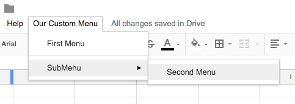
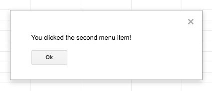
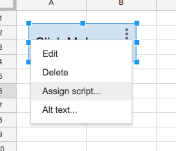

# Lesson 3 - Create custom menus

In this lesson we'll create a custom menu, a clickable button, and a clickable image in a Google Sheet.

## Lesson Steps

1. Open Google Drive: https://drive.google.com
2. Create a new Google Sheet and name our file: "LITA 2017 Custom Menu (Lesson 3)"
3. Click on the Tools menu and choose Script Editor. 
4. Copy in this code overwriting everything that is there:
```javascript
function onOpen() {
  var ui = SpreadsheetApp.getUi();
  // Or DocumentApp or FormApp.
  ui.createMenu('Our Custom Menu')
      .addItem('First Menu', 'menuOne')
      .addSeparator()
      .addSubMenu(ui.createMenu('SubMenu')
          .addItem('Second Menu', 'menuTwo'))
      .addToUi();
}
function menuOne() {
  SpreadsheetApp.getUi() // Or DocumentApp or FormApp.
     .alert('You clicked the first menu item!');
}
function menuTwo() {
  SpreadsheetApp.getUi() // Or DocumentApp or FormApp.
     .alert('You clicked the second menu item!');
}
function buttonClick() {
  SpreadsheetApp.getUi() // Or DocumentApp or FormApp.
     .alert('You clicked the button!');
}
```
5. Save and name your script. *[Remember you may have to authorize your script.](../authorize.md)* This code will add a custom menu to our sheet with a menu item and a sub-menu. You can see where it designates the name and the function that will run when that menu is clicked. 
6. Manually run the onOpen() function. *Note: onOpen() is a special function called a simple trigger and will normally run when a user opens a spreadsheet, document, or form.* If you look at your sheet, you will now have a new menu.<br /><br />

7. Click on one of the menus and it will run the appropriate function - *menuOne() or menuTwo()*:<br /><br />

8. **Exercise (10 min):** Create another menu item and put it anywhere in your menu. *Make sure to create a function that gets triggered when it runs!* Rather then re-run the onOpen function manually, what happens if you save the script, close your sheet and then open it back up?
9. You can also assign a function to an image or drawing. Back in our sheet, click the Insert -> Drawing menu. Add a rectangular shape to our sheet and enter the text "Click Me" inside it. 
10. Click on the three vertical dots to Assign a Script. *Tip: enter the function without the parenthese like "buttonClick".*<br /><br />

10. **Exercise (10 min):** Add an image to your sheet and assign a function to it. *Tip: easily add an image by URL with: https://source.unsplash.com/random*
11. *Tip: the three dots may be hard to find on your image, especially if you've already assigned a script or the image is dark and hides them. Use the right-click mouse button to select the item without clicking on it, then look for them in the upper right of the object.*

## Final Google Sheet

https://docs.google.com/spreadsheets/d/1lWE6zxqOta44FM5m7-oHTPFjBbP1fnTDIaKQth1fb78/edit?usp=sharing
*Don't try to run this script, you'll get an [error](../autherror.png). Copy the code and run it in your own Google Drive.*

## Resource list

Main GAS documentation: https://developers.google.com/apps-script/

Custom Menus: https://developers.google.com/apps-script/guides/menus

Simple Triggers: https://developers.google.com/apps-script/guides/triggers/
