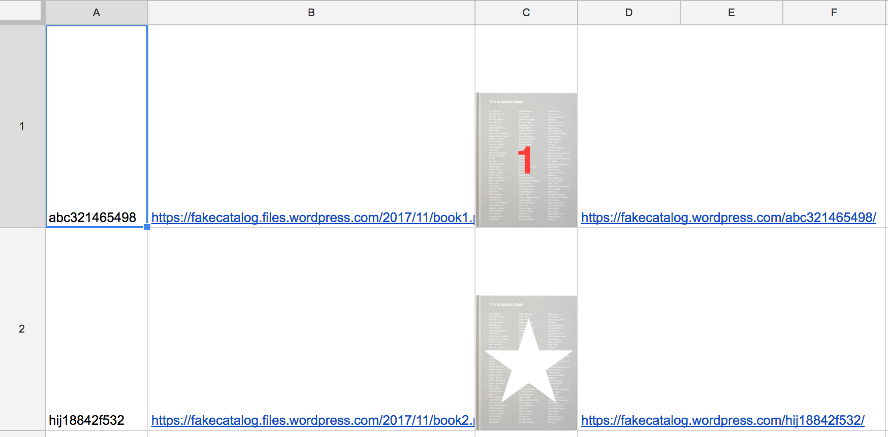
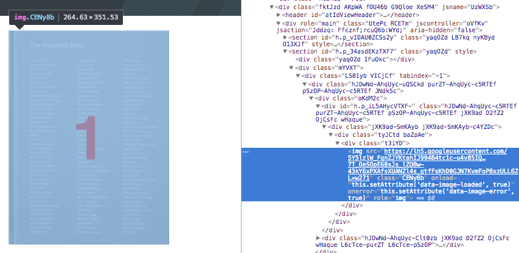
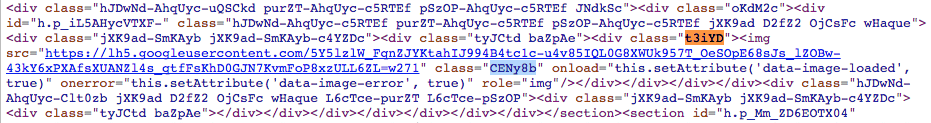

# Lesson 6 - Scraping the web

In this lesson we'll learn how to scrape a website. We are going to scrape a fake catalog for book cover images. This is so we don't overload any of 'real' catalogs and possibliy make them block us. Here is the Fake Catalog Site: https://fakecatalog.wordpress.com/ 

## Lesson Steps

1. Open Google Drive: https://drive.google.com
2. Create a new Google Sheet and name our file: "LITA 2017 Scrape (Lesson 6)"
3. Copy this into your sheet (these are our pretend ISBNs):
```
abc321465498
hij18842f532
lmn458137952
mno545558501
rst824713975
xyz582528202
```
4. Click on Tools menu and choose Script Editor. 
5. Copy in this code overwriting everything that is there:
```javascript
function callImageSearch() {
  var ss = SpreadsheetApp.getActiveSpreadsheet();
  var sheet = ss.getActiveSheet();
 
  //Loop through Column A, getting the ISBN numbers
  for (var i = 1; i < 500; i++) {
    
	var ISBNNumber = sheet.getRange(i,1).getValue();
	Logger.log('ISBNNumber: ' + ISBNNumber);
    
	// if the value is blank, no more ISBN Numbers! Break out!
	if (ISBNNumber == "") { break; }
        
        //example url: https://fakecatalog.wordpress.com/hij18842f532/
	var ISBNURL = 'https://fakecatalog.wordpress.com/' + ISBNNumber + '/';
	var html = UrlFetchApp.fetch(ISBNURL).getContentText();
    
	if (html) {
  	  if (html.indexOf('zfr3Q JYVBee') >= 0) {
    	  // Image is present
    	  var locURL = html.indexOf('zfr3Q JYVBee');
    	  var locSpace = html.indexOf('img',locURL);
    	  var localURL = html.substring(locURL+23,locSpace-3)
  	  } else {
      	  var localURL = "No Image";
  	  }
	}
	Logger.log('locURL: ' +locURL);
	Logger.log('locSpace: ' +locSpace);
	Logger.log('localURL: ' +localURL);   

	var cell = sheet.getRange("B"+i);
	cell.setValue(localURL);
    
	var image = '=image(B' + i + ',1)';
	var imagecell = sheet.getRange("C"+i);
	imagecell.setValue(image);
    
	var ISBNlinkcell = sheet.getRange("D"+i);
	ISBNlinkcell.setValue(ISBNURL);
    
        // Sets the row to a height of 100 pixels so we can see the image
	sheet.setRowHeight(i, 200);

	//clear the variables
	locURL = "";
	locSpace = "";
	localURL = "";

  }
}
//Run once to create the menu to run from the sheet!
function onOpen() {
  var ui = SpreadsheetApp.getUi();
  ui.createMenu('Scrape the Web')
  	.addItem('Get Image URLs from ISBN Numbers in col A','callImageSearch')
  	.addToUi();
}
```
6. Save. *[Remember you may have to authorize your script.](../authorize.md)* Then manually run the onOpen function to create the menu.
7. Back in the sheet, run the new menu option to Scrape the Web. You should see this:<br /><br />

8. Let's look at the code to see what it's doing:<br />
First, we get the active sheet, and loop through the ISBN numbers in col A. Then we get the URL and fetch it.
```
var ISBNURL = 'https://fakecatalog.wordpress.com/' + ISBNNumber + '/';
var html = UrlFetchApp.fetch(ISBNURL).getContentText();
```
With the entire HTML page in a variable, we can search for the specific string which will mark the image file.
```
var locURL = html.indexOf('zfr3Q JYVBee');
var locSpace = html.indexOf('img',locURL);
var localURL = html.substring(locURL+23,locSpace-3)
```
This is a perfect example why scraping a website is an inexact science and APIs are a much better option! With the URL, we write out the data and image into the sheet.<br /><br />
9. **Excersize (15 min):** Get the image url from http://www.worldcat.org/title/little-life-a-novel/oclc/886672369. Some tips: Google Dev Tools can help find or select HTML elements. Find a unique tag or string before and after the image url. For example, in the previous steps, we used the dev tools to find the image url:<br /><br />
<br /><br />
Then looked for a unique string before and after the image URL:<br /><br />


## Final Google Sheet

https://docs.google.com/spreadsheets/d/10B6sOAaJeiwFKPTQyzoV87oLRwBZUA0ogrvLazU2JHw/edit?usp=sharing

## Resource list

Main GAS documentation: https://developers.google.com/apps-script/

UrlFetchApp: https://developers.google.com/apps-script/reference/url-fetch/url-fetch-app

Free Images: https://unsplash.com/photos/rMYrkFfw36U
