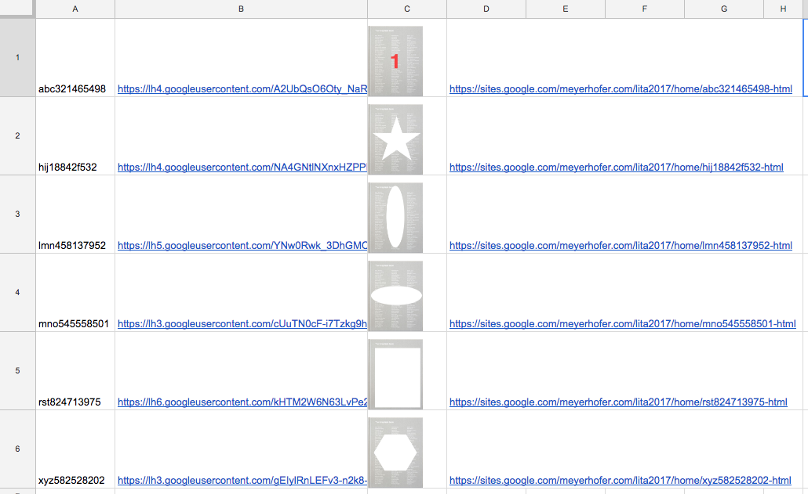

# Lesson Five - Scraping the web

In this lesson we'll learn how to scrape a website. We are going to scrape a fake catalog for book cover images. This is so we don't overload any of the real catalogs and possibliy make them block us. Here is the Fake Book Site: https://sites.google.com/meyerhofer.com/lita2017/home 

## Lesson Steps

1. Open Google Drive: https://drive.google.com
2. Create a new Google Sheet and name our file: "LITA 2017 Scrape (Lesson Six)"
3. Copy this into your sheet (these are our pretend ISBNs):
```
abc321465498
hij18842f532
lmn458137952
mno545558501
rst824713975
xyz582528202
```
4. Click on Tools menu and choose Script Editor. 
5. Copy in this code overwriting everything that is there:
```javascript
function callImageSearch() {
  var ss = SpreadsheetApp.getActiveSpreadsheet();
  var sheet = ss.getActiveSheet();
 
  //Loop through Column A, getting the ISBN numbers
  for (var i = 1; i < 500; i++) {
    
	var ISBNNumber = sheet.getRange(i,1).getValue();
	Logger.log('ISBNNumber: ' + ISBNNumber);
    
	// if the value is blank, no more ISBN Numbers! Break out!
	if (ISBNNumber == "") { break; }
        
        //example url: https://sites.google.com/meyerhofer.com/lita2017/home/mno545558501-html
	var ISBNURL = 'https://sites.google.com/meyerhofer.com/lita2017/home/' + ISBNNumber + '-html';
	var html = UrlFetchApp.fetch(ISBNURL).getContentText();
 
	if (html) {
  	  if (html.indexOf('CENy8b') >= 0) {
    	  // Image is present
    	  var locURL = html.indexOf('t3iYD');
    	  var locSpace = html.indexOf('CENy8b',locURL);
    	  var localURL = html.substring(locURL+17,locSpace-9)
  	  } else {
      	  var localURL = "No Image";
  	  }
	}
	Logger.log('locURL: ' +locURL);
	Logger.log('locSpace: ' +locSpace);
	Logger.log('localURL: ' +localURL);   

	var cell = sheet.getRange("B"+i);
	cell.setValue(localURL);
    
	var image = '=image(B' + i + ',4,90,70)';
	var imagecell = sheet.getRange("C"+i);
	imagecell.setValue(image);
    
	var ISBNlinkcell = sheet.getRange("D"+i);
	ISBNlinkcell.setValue(ISBNURL);
    
        // Sets the row to a height of 100 pixels so we can see the image
	sheet.setRowHeight(i, 100);

	//clear the variables
	locURL = "";
	locSpace = "";
	localURL = "";

  }
}
//Run once to create the menu to run from the sheet!
function onOpen() {
  var ui = SpreadsheetApp.getUi();
  ui.createMenu('Scrape the Web')
  	.addItem('Get Image URLs from ISBN Numbers in col A','callImageSearch')
  	.addToUi();
}
```
6. Save. *[Remember you may have to authorize your script.](../authorize.md)* Then manually run the onOpen function to create the menu.
7. Back in the sheet, run the new menu option to Scrape the Web. You should see this:

8. Let's look at the code to see what it's doing:<br />
First, we get the active sheet, and loop through the ISBN numbers in col A. Then we get the URL and fetch it.
```
var ISBNURL = 'https://sites.google.com/meyerhofer.com/lita2017/home/' + ISBNNumber + '-html';
var html = UrlFetchApp.fetch(ISBNURL).getContentText();
```
With our HTML page in a variable, we can search for the specific string which will mark the image file.
```
var locURL = html.indexOf('t3iYD');
var locSpace = html.indexOf('CENy8b',locURL);
var localURL = html.substring(locURL+17,locSpace-9)
```
This is a perfect example why scraping a website is an inexact science! With the URL, we write out the data and image to the website.
9. Excersize?
10. ?


<br /><br /><br /><br /><br /><br /><br /><br />
code, get first image? they do others? code should loop? feed from ISBNs?


remember be good about scrapign websites! scrapign an exact science. APIs better!

inline linking? 


challenge: https://www.googleapis.com/books/v1/volumes?q=oclc:886672369 
google book api?


**Background:** Open this URL in a browser window: https://api.oadoi.org/10.1088/0004-637x/812/2/158. This has called the oaDOI API (https://oadoi.org/api) returning JSON data about that DOI. This API gives us access to oaDOI's data about DOIs and their details. We are going to create a simple application that will take a DOI input, call the oaDOI API, and display the data we get back. Remember, when calling APIs, to follow their rules. Many times you'll need a key or to pass an identifier with the call. Also, call APIs responsibily by spacing your calls if you can.


7. The other code is new, so let's walk through it:<br />
This code gets the active sheet, then sets the value of cell B1. This is a nice way to visually see what the code is doing.
```javascript
    var ss = SpreadsheetApp.getActiveSpreadsheet();
    var sheet = ss.getActiveSheet();
    var cell = sheet.getRange("B1");
    cell.setValue("STATUS: Starting...");
```
Here we are getting the value of cell A1, which should have our DOI, making sure it doesn't have any spaces before or after it.
```javascript
    var DOInumber = sheet.getRange("A1").getValue();
    DOInumber = DOInumber.trim();
    var cell = sheet.getRange("A1");
    cell.setValue(DOInumber);
```
This code pieces together our URL then uses the URLFetch function to open it and then put the return value, a JSON string, into a variable.
```javascript
    var doiJSON = 'https://api.oadoi.org/' + DOInumber + '?email=' + email_key;
    var json = UrlFetchApp.fetch(doiJSON);
    var response = json.getContentText();
    var data = JSON.parse(response);
```
We then put that JSON string in the A3 cell.
```javascript
    var cell = sheet.getRange("A3");
    cell.setValue(response);
```
Finally, we navigate the JSON file, and get the value of the doi and put it in cell B5.
```javascript
    if ('doi' in data['results'][0]) {
      var doi = data['results'][0]['doi'];
      var cell = sheet.getRange("A5");
      cell.setValue("doi");
      var cell = sheet.getRange("B5");
      cell.setValue(doi);
    }
```
8. Now with the knowledge of what the code is doing, we can go back to our sheet and enter a DOI in cell A1 (ex. 10.1088/0004-637x/812/2/158).
9. Click the menu to "Call oaAPI". You should see:<br /><br /> 

10. **Excersize (5 min):** Try other DOIs. Do you always get the same values back? What's different? Why is it different? Ready more about oaDOI's API DOI object: https://oadoi.org/api/v2#doi-object
11. **Excersize (10-15 min):** Expand your script to get other individual values from the JSON string. Can you get the URL value?
12. **Challenge Excersize (10 min):** Can you call the [Crossref API](https://github.com/CrossRef/rest-api-doc) and extract its data? Example: https://api.crossref.org/works/10.1037/0003-066X.59.1.29

**Note: This is just one of the many APIs you can call from GAS. In some cases you may need a [key](https://en.wikipedia.org/wiki/Application_programming_interface_key) to performa a call. More APIs can be found at https://apilist.fun/ and https://github.com/toddmotto/public-apis.**

## Final Google Sheet

https://docs.google.com/spreadsheets/d/1k21QDclGmK1YGOiyPuOUq4_QnISM4OXmVr1qfFgOxSg/edit?usp=sharing

## Resource list

Main GAS documentation: https://developers.google.com/apps-script/

UrlFetchApp: https://developers.google.com/apps-script/reference/url-fetch/url-fetch-app

Free Images: https://unsplash.com/photos/rMYrkFfw36U
