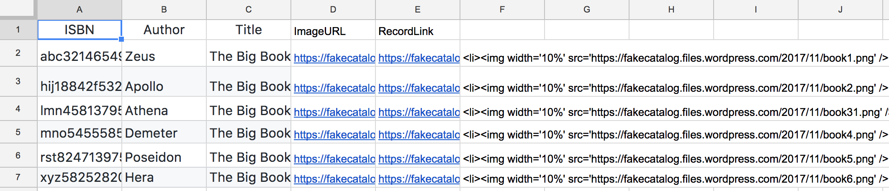
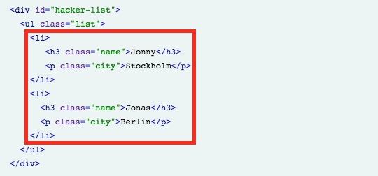
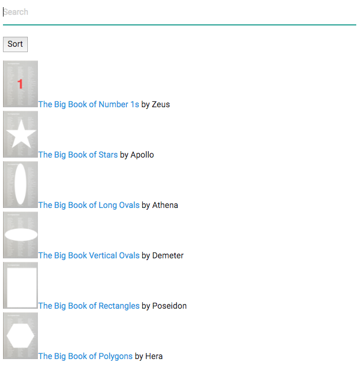

# Lesson Seven - New Book List

In this lesson we'll create a new book list webpage.

## Lesson Steps

1. Open Google Drive: https://drive.google.com
2. Create a new Google Sheet and name our file: "LITA 2017 New Book List (Lesson Seven)"
3. Copy this into your sheet (this is our pretend new book data):
<table>
<tr><td>ISBN</td><td>Author</td><td>Title</td></tr>
<tr><td>abc321465498</td><td>Zeus</td><td>The Big Book of Number 1s</td></tr>
<tr><td>hij18842f532</td><td>Apollo</td><td>The Big Book of Stars</td></tr>
<tr><td>lmn458137952</td><td>Athena</td><td>The Big Book of Long Ovals</td></tr>
<tr><td>mno545558501</td><td>Demeter</td><td>The Big Book Vertical Ovals</td></tr>
<tr><td>rst824713975</td><td>Poseidon</td><td>The Big Book of Rectangles</td></tr>
<tr><td>xyz582528202</td><td>Hera</td><td>The Big Book of Polygons</td></tr>
</table>

4. Click on Tools menu and choose Script Editor.<br /> 
5. Copy in this code overwriting everything that is there:<br />
```javascript

function callImageSearch() {
  var ss = SpreadsheetApp.getActiveSpreadsheet();
  var sheet = ss.getActiveSheet();
  
  var cell = sheet.getRange("D1");
  cell.setValue("ImageURL");
  
  var cell = sheet.getRange("E1");
  cell.setValue("RecordLink");
  
  //Loop through Column A, getting the ISBN numbers
  for (var i = 2; i < 500; i++) {
    
	var ISBNNumber = sheet.getRange(i,1).getValue();
	Logger.log('ISBNNumber: ' + ISBNNumber);
    
	// if the value is blank, no more ISBN Numbers! Break out!
	if (ISBNNumber == "") { break; }
        
        //example url: https://fakecatalog.wordpress.com/hij18842f532/
	var ISBNURL = 'https://fakecatalog.wordpress.com/' + ISBNNumber + '/';
	var html = UrlFetchApp.fetch(ISBNURL).getContentText();
    
	if (html) {
  	  if (html.indexOf('zfr3Q JYVBee') >= 0) {
    	  // Image is present
    	  var locURL = html.indexOf('zfr3Q JYVBee');
    	  var locSpace = html.indexOf('img',locURL);
    	  var localURL = html.substring(locURL+23,locSpace-3)
  	  } else {
      	  var localURL = "No Image";
  	  }
	}
	Logger.log('locURL: ' +locURL);
	Logger.log('locSpace: ' +locSpace);
	Logger.log('localURL: ' +localURL);   

	var cell = sheet.getRange("D"+i);
	cell.setValue(localURL);
  
	var ISBNlinkcell = sheet.getRange("E"+i);
	ISBNlinkcell.setValue(ISBNURL);
    
	//clear the variables
	locURL = "";
	locSpace = "";
	localURL = "";

  }
}
//Run once to create the menu to run from the sheet!
function onOpen() {
  var ui = SpreadsheetApp.getUi();
  ui.createMenu('Scrape the Web')
  	.addItem('Get Image URLs from ISBN Numbers in col A','callImageSearch')
  	.addToUi();
}
```
6. This is the code we created from Lesson 6 but changed a little for this lesson. 
7. Save. *[Remember you may have to authorize your script.](../authorize.md)* Then manually run the onOpen function to create the menu.
8. Now you can run the custom menu function to get the image and record URL.<br /><br />

9. Now we're going to create a new book list using this data. To do so, we'll utilize a JavaScript library called [List.js](http://listjs.com/). This library takes an HTML list index and can create a simple search and sort interface for our new book list webpage.<br /><br />

10. Let's start by concatenating our data into li tags. In our Google Sheet enter this into cell F2:
```
=CONCATENATE("<li><a class='title' href='", E2,"'> ", C2, "</a> by ", B2, "</li>")
```
11. This code will string together our data with some HTML tags to create a list. Highlight cells F2:F7 and press cmd+D or ctrl+D to fill down the formula.
12. In your favorite text editor, enter in this code to create our HTML file:
```
<!DOCTYPE html>
<html>
  <head>
    <base target="_top">  <!-- Compiled and minified CSS -->
  <link rel="stylesheet" href="https://cdnjs.cloudflare.com/ajax/libs/materialize/0.100.2/css/materialize.min.css">

  </head>
  <body>
    <div class="container">
    <div id="books">

<!-- class="search" automagically makes an input a search field. -->
  <input class="search" placeholder="Search" />
<!-- class="sort" automagically makes an element a sort buttons. The date-sort value decides what to sort by. -->
  <button class="sort" data-sort="title">
    Sort
  </button>

<!-- Child elements of container with class="list" becomes list items -->
  <ul class="list">
    
    <!-- LIST INDEX HERE!!!! -->
    
  </ul>
</div>
    
  <script src="https://cdnjs.cloudflare.com/ajax/libs/list.js/1.5.0/list.min.js"></script>
  <script>
  
  var options = {
  valueNames: [ 'title' ]
};

var userList = new List('books', options);

</script>
</div>
  </body>
</html>

```
10. Save your file to your Desktop. 
11. Copy the values from F2:F7 in your Google Sheet into the UL list object where it says LIST INDEX HERE. 
12. Save and then open the file in a browser. You should see a nice new book list:

13. Test the New Book List by clicking on the sort and searching for 'oval'.

## Final Google Sheet

https://docs.google.com/spreadsheets/d/1pQVokR_X-3utnx-7DKEizhxXXk5WdjCBU1MB0ObBvh0/edit?usp=sharing

## Resource list 

Main GAS documentation: https://developers.google.com/apps-script/

List.js: http://listjs.com/
