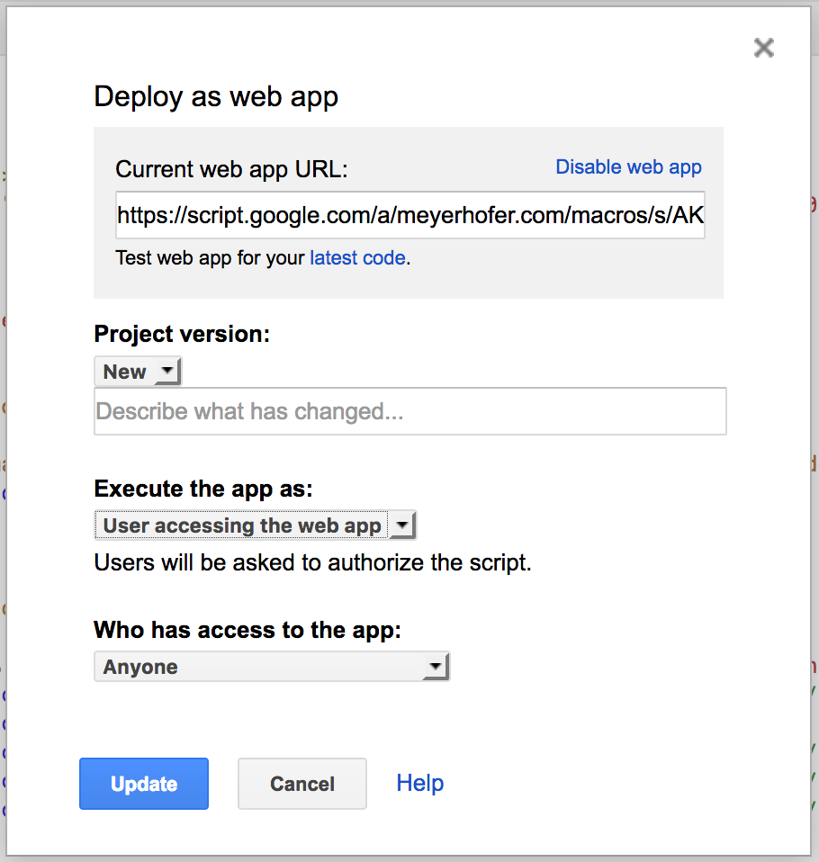
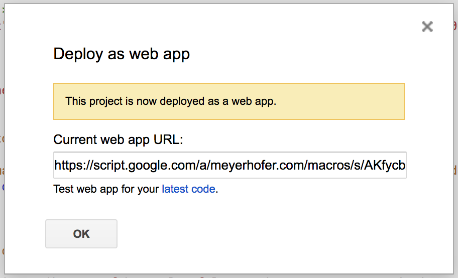
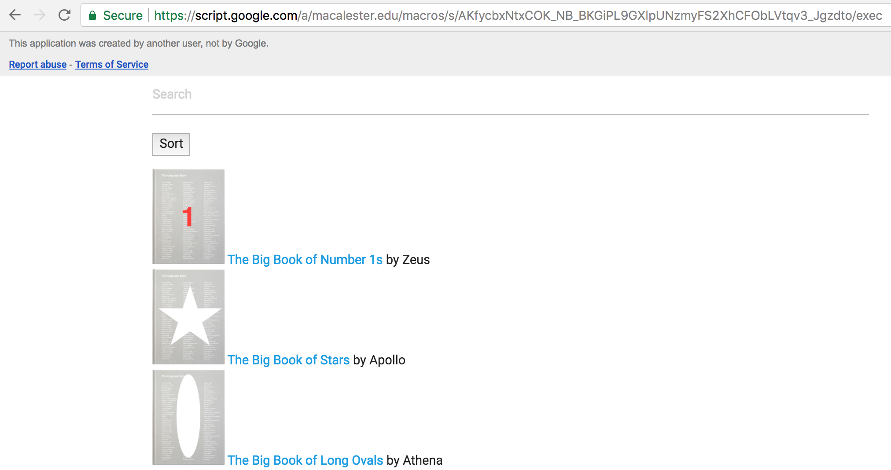
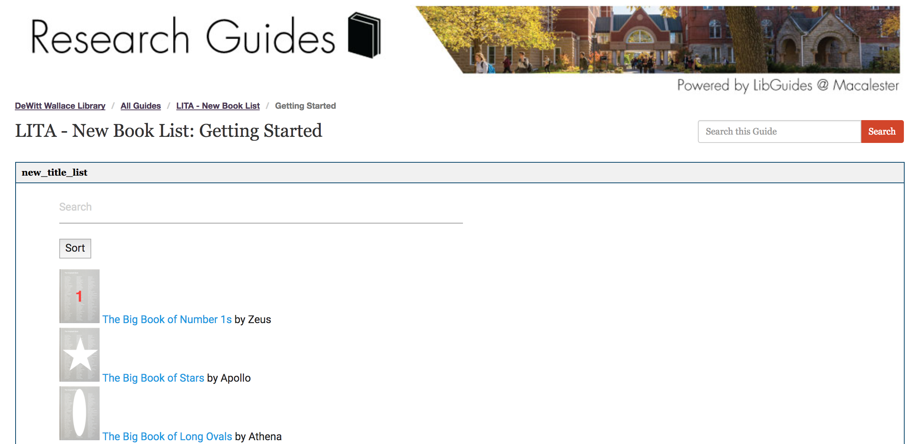

# Lesson 8 - Web App

In this lesson we'll create a new Google Apps Script Web App.

## Lesson Steps

In the previous lesson, we built a New Book page. It was nice and functional, but requires us to update our display HTML file every time we add new data. With GAS Web Apps we can create a script that will dynamically include content in a webpage instead.

1. Open Google Drive: https://drive.google.com
2. **Copy** your Google Sheet from [Lesson 7](../Lesson_7/). If you didn't have time to finish, copy the final version listed at the bottom.
3. Click on the Tools menu and choose Script Editor.<br /> 
4. Add this code to your existing code.
```javascript
function doGet() {
  var html = HtmlService.createTemplateFromFile('books').evaluate()
            .setTitle('web app').setXFrameOptionsMode(HtmlService.XFrameOptionsMode.ALLOWALL);
  return html;
  
}
```
5. The doGet function is a special function that tells the script how to serve the page to who ever calls our Web App. The function creates a template from the 'books' file. Then it sends it back to the application that called. it.
6. Let's create out 'books' File. Click File -> New -> Html file and replace the existing code with this:
```
<!DOCTYPE html>
<html>
  <head>
    <base target="_top">  <!-- Compiled and minified CSS -->
  <link rel="stylesheet" href="https://cdnjs.cloudflare.com/ajax/libs/materialize/0.100.2/css/materialize.min.css">

  </head>
  <body>
    <div class="container">
    <div id="books">

<!-- class="search" automagically makes an input a search field. -->
  <input class="search" placeholder="Search" />
<!-- class="sort" automagically makes an element a sort buttons. The date-sort value decides what to sort by. -->
  <button class="sort" data-sort="title">
    Sort
  </button>

<!-- Child elements of container with class="list" becomes list items -->
  <ul class="list">
    <li><a class='title' href='https://fakecatalog.wordpress.com/abc321465498/'> The Big Book of Number 1s</a> by Zeus</li>
<li><a class='title' href='https://fakecatalog.wordpress.com/hij18842f532/'> The Big Book of Stars</a> by Apollo</li>
<li><a class='title' href='https://fakecatalog.wordpress.com/lmn458137952/'> The Big Book of Long Ovals</a> by Athena</li>
<li><a class='title' href='https://fakecatalog.wordpress.com/mno545558501/'> The Big Book Vertical Ovals</a> by Demeter</li>
<li><a class='title' href='https://fakecatalog.wordpress.com/rst824713975/'> The Big Book of Rectangles</a> by Poseidon</li>
<li><a class='title' href='https://fakecatalog.wordpress.com/xyz582528202/'> The Big Book of Polygons</a> by Hera</li>
    
  </ul>
</div>
    
  <script src="https://cdnjs.cloudflare.com/ajax/libs/list.js/1.5.0/list.min.js"></script>
  <script>
  
  var options = {
  valueNames: [ 'title' ]
};

var userList = new List('books', options);

</script>
</div>
  </body>
</html>
```
7. Instead of putting our content at the end point, we can add it to the Web App. 
8. Save your files. *[Remember you may have to authorize your script.](../authorize.md)* 
9. Now click on the Publish -> Deploy as web app menu. 

10. See Google's help for [details about each setting](https://developers.google.com/apps-script/guides/web#deploying_a_script_as_a_web_app), but most remain at their defaults. Typically, you should create a new version each time you publish to ensure your Web App gets updated.
11. Now we can open the apps URL.

12. Copy the URL and paste it into a new browser window

13. You can also use an iframe tag to embed the Web App in a web page
```
<iframe frameborder="0" src="https://script.google.com/a/meyerhofer.com/macros/s/AKfycbxNtxCOK_NB_BKGiPL9GXlpUNzmyFS2XhCFObLVtqv3_Jgzdto/exec" style="width: 625px; height: 800px;"></iframe>
```
Or in a LibGuide:


Excersize???


5. Copy in this code overwriting everything that is there:<br />
```javascript

function callImageSearch() {
  var ss = SpreadsheetApp.getActiveSpreadsheet();
  var sheet = ss.getActiveSheet();
  
  var cell = sheet.getRange("D1");
  cell.setValue("ImageURL");
  
  var cell = sheet.getRange("E1");
  cell.setValue("RecordLink");
  
  //Loop through Column A, getting the ISBN numbers
  for (var i = 2; i < 500; i++) {
    
	var ISBNNumber = sheet.getRange(i,1).getValue();
	Logger.log('ISBNNumber: ' + ISBNNumber);
    
	// if the value is blank, no more ISBN Numbers! Break out!
	if (ISBNNumber == "") { break; }
        
        //example url: https://fakecatalog.wordpress.com/hij18842f532/
	var ISBNURL = 'https://fakecatalog.wordpress.com/' + ISBNNumber + '/';
	var html = UrlFetchApp.fetch(ISBNURL).getContentText();
    
	if (html) {
  	  if (html.indexOf('zfr3Q JYVBee') >= 0) {
    	  // Image is present
    	  var locURL = html.indexOf('zfr3Q JYVBee');
    	  var locSpace = html.indexOf('img',locURL);
    	  var localURL = html.substring(locURL+23,locSpace-3)
  	  } else {
      	  var localURL = "No Image";
  	  }
	}
	Logger.log('locURL: ' +locURL);
	Logger.log('locSpace: ' +locSpace);
	Logger.log('localURL: ' +localURL);   

	var cell = sheet.getRange("D"+i);
	cell.setValue(localURL);
  
	var ISBNlinkcell = sheet.getRange("E"+i);
	ISBNlinkcell.setValue(ISBNURL);
    
	//clear the variables
	locURL = "";
	locSpace = "";
	localURL = "";

  }
}
//Run once to create the menu to run from the sheet!
function onOpen() {
  var ui = SpreadsheetApp.getUi();
  ui.createMenu('Scrape the Web')
  	.addItem('Get Image URLs from ISBN Numbers in col A','callImageSearch')
  	.addToUi();
}
```
6. This is the code we created from Lesson 6 but changed a little for this lesson. 
7. Save. *[Remember you may have to authorize your script.](../authorize.md)* Then manually run the onOpen function to create the menu.
8. Now you can run the custom menu function to get the image and record URL. This is just like Lesson 6, we are just changing the formatting.<br /><br />

9. Now we're going to create a new book list using this data. To do so, we'll utilize a JavaScript library called [List.js](http://listjs.com/). This library takes an HTML list index and can create a simple search and sort interface for our new book list webpage.<br /><br />

10. Let's start by concatenating our data into li tags. In our Google Sheet enter this into cell F2:
```
=CONCATENATE("<li><a class='title' href='", E2,"'> ", C2, "</a> by ", B2, "</li>")
```
11. This code will string together our data with some HTML tags to create a list. Highlight cells F2:F7 and press cmd+D or ctrl+D to fill down the formula.
12. In your favorite text editor, enter in this code to create a HTML file that will use the List.js library and our HTML data to create a new book page:
```
<!DOCTYPE html>
<html>
  <head>
    <base target="_top">  <!-- Compiled and minified CSS -->
  <link rel="stylesheet" href="https://cdnjs.cloudflare.com/ajax/libs/materialize/0.100.2/css/materialize.min.css">

  </head>
  <body>
    <div class="container">
    <div id="books">

<!-- class="search" automagically makes an input a search field. -->
  <input class="search" placeholder="Search" />
<!-- class="sort" automagically makes an element a sort buttons. The date-sort value decides what to sort by. -->
  <button class="sort" data-sort="title">
    Sort
  </button>

<!-- Child elements of container with class="list" becomes list items -->
  <ul class="list">
    
    <!-- LIST INDEX HERE!!!! -->
    
  </ul>
</div>
    
  <script src="https://cdnjs.cloudflare.com/ajax/libs/list.js/1.5.0/list.min.js"></script>
  <script>
  
  var options = {
  valueNames: [ 'title' ]
};

var userList = new List('books', options);

</script>
</div>
  </body>
</html>

```
10. Save your file to your Desktop. 
11. Copy the values from F2:F7 in your Google Sheet into the UL list object where it says "LIST INDEX HERE". 
12. Save and then open the file in a browser. You should see a nice new book list:

13. Test the New Book List by clicking on the sort and searching for 'oval'.

## Final Google Sheet

https://docs.google.com/spreadsheets/d/1pQVokR_X-3utnx-7DKEizhxXXk5WdjCBU1MB0ObBvh0/edit?usp=sharing
*Don't try to run this script, you'll get an [error](../autherror.png). Copy the code and run it in your own Google Drive.*

## Resource list 

Main GAS documentation: https://developers.google.com/apps-script/

Web Apps: https://developers.google.com/apps-script/guides/web

HTML Service: https://developers.google.com/apps-script/guides/html/

