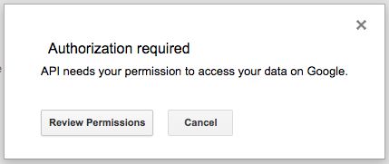
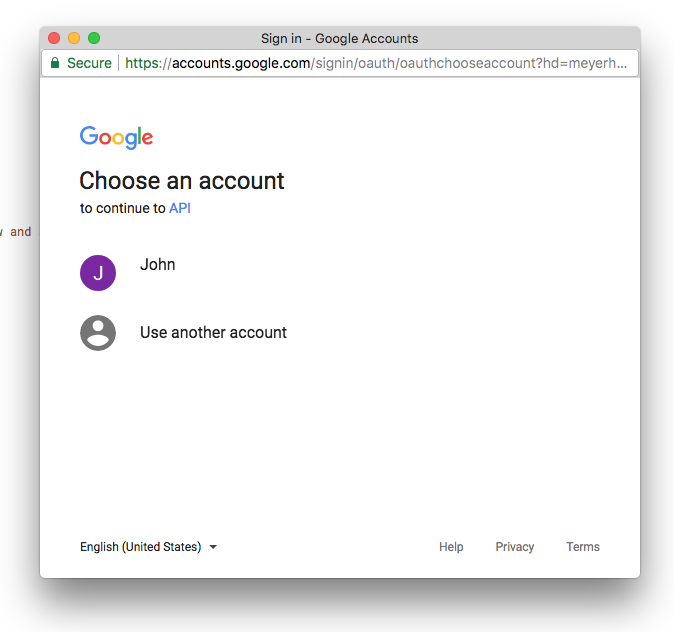
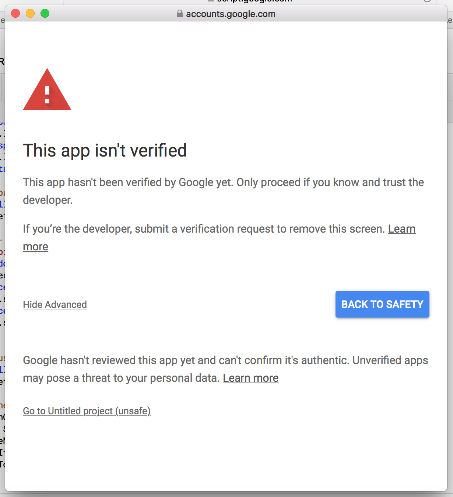
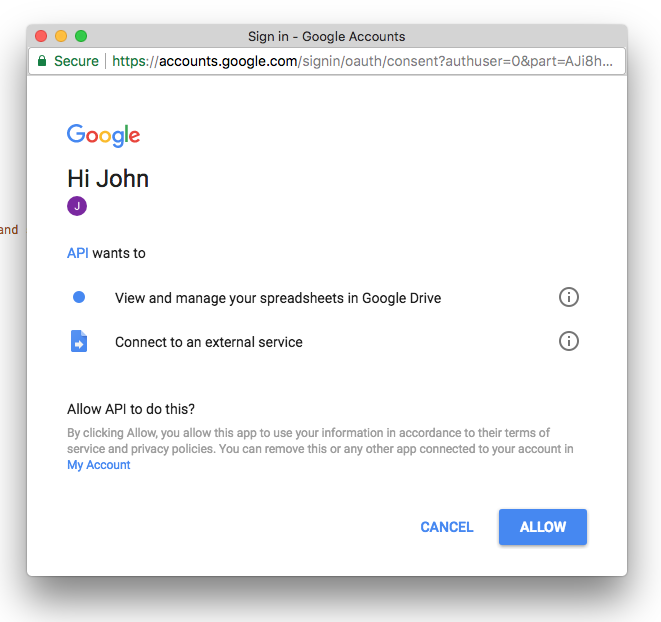

Many times while working with Google Apps Script, you will have to authorize your script to run. Google Apps Script requires user authorization to access private data from built-in Google services or advanced Google services.

Typically it looks like this:
You will get a general prompt to review permissions  
  
Next you choose the account to authorize  
  
You may see this error, if you feel safe to authorize it, click the advanced link, then the link to go to the project.  
  
Finally, you allow the script access  
  

If your script doesn't seem to be working, save or close and open your file to trigger the authorization process.
You may have to re-authorize your script if there have been a lot of changes.

## Resources

Authorization for Google Services: https://developers.google.com/apps-script/guides/services/authorization
